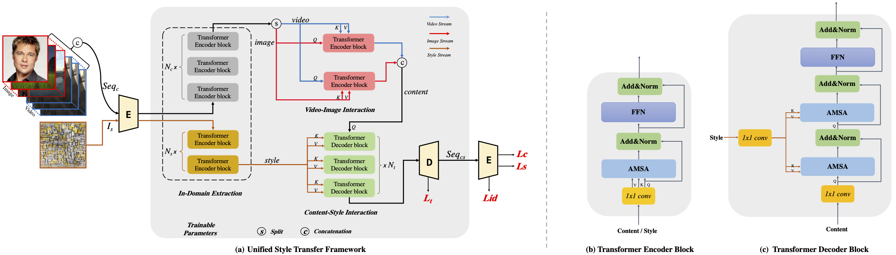
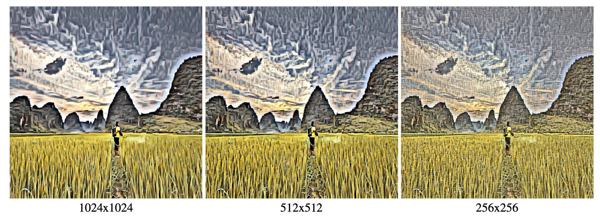
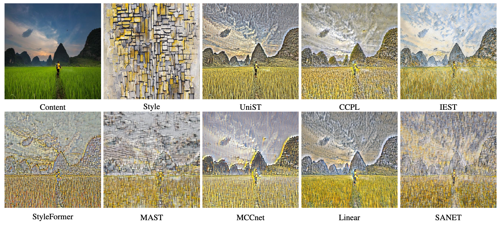

# UniST : Two Birds, One Stone: A Unified Framework for Joint Learning of Image and Video Style Transfers (ICCV2023)
*Authors: Bohai Gu, Heng Fan, Libo Zhang* <br>
This repository is the official pytorch implementation of [Two Birds, One Stone: A Unified Framework for Joint Learning of Image and Video Style Transfers](https://arxiv.org/abs/2304.11335). <br>
Which proposes an unified style transfer framework, dubbed UniST, for arbitrary image and video style transfers, in which two tasks can benefit from each other to improve the performance.

## Overview


The proposed network leverages the local and long-range dependencies jointly. More specifically, UniST first applies CNNs to generate tokens, and then models long-range dependencies 
to excavate domain-specific information with domain interaction transformer (*DIT*). Afterwards, *DIT* sequentially interacts contextualized domain information for joint learning.


## Results
*Both images and videos are provided with finest grainuarity style transfer results.* <br>
### Image Style Transfer

### Video Style Transfer
<p align="center">
    
    
    
    
</p>

## Application
Except the arbitrary image and video style transfers, UniST provides the multi-granularity style transfer.

*Style resolutions are 1024x1024, 512x512, 256x256, respectively.* <br>

Compared with some state-of-the-art algorithms, our method has a strong ability to generate finest grainuarity results with better feature representation.
(Some of the SOATs are not supported for multi-granularity style transfer.)



## Experiment
### Requirements
- python 3.6
- pytorch 1.6.0
- torchvision 0.4.2
- PIL, einops, matplotlib
- tqdm

### Testing
Please download [Pretrained models](https://drive.google.com/file/d/1UdTVKyCikrHDc7bMHXCuRL1YCc5URIUl/view?usp=sharing) and put into the floder ./weight. <br>

Please configure paramters in ./option/test_options.py. And set the pretrained checkpoint in ./models/model.py. <br>

For **[multi_granularity](application/multi_granularity/readme.md)** and **[single_modality](application/single_modality/readme.md)** , please refer to the scripts in ./application.

```python
python scripts/inference.py
```

### Training
Pretrained models: [vgg_r41.pth, dec_r41.pth, vgg_r51.pth](https://drive.google.com/drive/folders/1wEfUwgg8xNnWT87pEiOGq4JA9My-Jiav?usp=sharing).
Please download them and put into the floder ./weight. <br>

Style dataset is WikiArt collected from [WIKIART](https://www.wikiart.org/). <br>
Content dataset is [COCO dataset](http://images.cocodataset.org/zips/train2014.zip) for image, and [MPI dataset](http://sintel.is.tue.mpg.de/) or [DAVIS](https://davischallenge.org/) for video.

Please configure paramters in ./option/train_options.py

```python
python scripts/train.py 
```

### BibTeX
If this repo is useful to you, please cite our technical paper.
```bibtex
@InProceedings{Gu_2023_ICCV,
    author    = {Gu, Bohai and Fan, Heng and Zhang, Libo},
    title     = {Two Birds, One Stone: A Unified Framework for Joint Learning of Image and Video Style Transfers},
    booktitle = {Proceedings of the IEEE/CVF International Conference on Computer Vision (ICCV)},
    month     = {October},
    year      = {2023},
    pages     = {23545-23554}
}
```
### Acknowledgments
We would like to express our gratitude for the contributions of several previous works to the implementation of UniST. This includes, but is not limited 
to **[pixel2style2pixel](https://github.com/eladrich/pixel2style2pixel)** ,**[attention-is-all-you-need](https://github.com/jadore801120/attention-is-all-you-need-pytorch)**.
